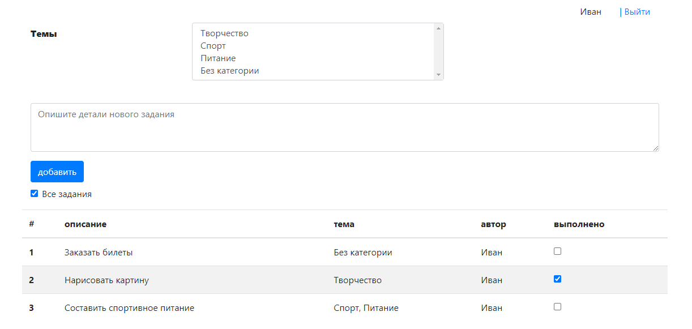

# job4j_todo
Приложение "TODO список".  
Приложение имеет одну страницу со списком задач.

Архитектура Model-View-Controller.  
Сервис реализован с помощью servlet, страницы на JSP с обновлением задач через ajax.
База данных postgres с hibernate.  

Список всех заданий:

Список не выполненных заданий:

